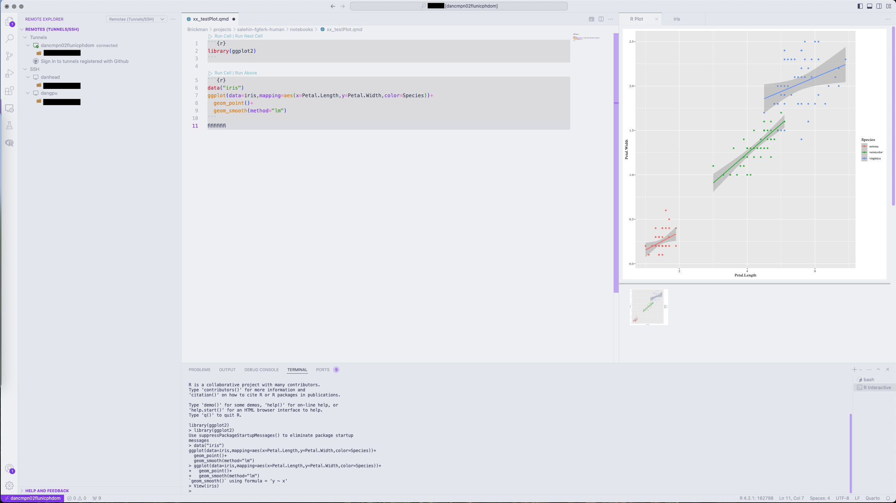

# Setup R with Visual Studio Code

This setup guides you through setting up `R` in [VSCode](https://code.visualstudio.com)
so you can use it on `dancmpn01fl` and `dancmpn02fl` computing nodes.

!!! info

    The original RStudio server is using 4.0.5 version. If you want to stick
    this version, make sure to specify it when loading modules.

!!! question "Why do you need this?"

    Because RStudio server sucks when you don't have a license and our place, so
    alternative it is. Also, VSCode has a bunch of plugins.

## Setting up Remote Tunnels

!!! warning

    In this example we use version **R/4.2.1**. If you want to use a different one
    change the R version!

### Requirements

- [x] VSCode
- [x] Terminal

### Setting up first time

1. Login to head node: `ssh $USER@danhead01fl.unicph.domain`
2. Start a new tmux session: `tmux new -s rstudio`
3. Start a new job: `srun -c 2 --mem=30gb --time=0-4:00:00 --pty bash`
4. Load modules: `module load vscode_cli gcc/11.2.0 R/4.2.1 quarto`
5. Run command: `code tunnel`
    1. Choose `Microsoft account` when asked how you would like to log in to VScode
    2. Open the link from terminal and paste the **CODE**
    3. Login with your KU credentials
    4. Go back to terminal and wait
    5. Hit <kbd>ENTER</kbd> on questions about tunnel name
    6. If everything went well you should see some random messages about port forwarding
6. Go to your VSCode and on the left panel search for `Remote Explorer`
7. Click `Sign in to the tunnels registered with Microsoft`
    1. You should see `dancmpn01flunicphdom` or `dancmpn02flunicphdom`
8. Move cursor on it and click the `->`
9. Install extension [Remote Tunnels](https://marketplace.visualstudio.com/items?itemName=ms-vscode.remote-server)


To use `R`, install additional packages by clicking `Extensions` in the left panel.
Search for packages:

- [R](https://marketplace.visualstudio.com/items?itemName=REditorSupport.r)
- [Quarto](https://marketplace.visualstudio.com/items?itemName=quarto.quarto)

1. Next, top panel lick `View` -> `Terminal` -> Write `R` and hit <kbd>ENTER</kbd>
2. `install.packages("languageserver")`
    1. If it asks to install to stuff to other directory type `YES` then hit <kbd>ENTER</kbd>
    2. When asking about mirror type `30` (Denmark servers to download packages)
3. `install.packages("httpgd")`
4. `q()` to get out
5. Top left panel: `Code` -> `Settings` -> `Settings`
    1. Type in search `r.plot.useHttpgd`
    2. Tick the box if it is not checked

If everything went well, you should be able to do this. If not, you know what
to do.



### I already did the setup, I want my R again

1. Login to head node: `ssh $USER@danhead01fl.unicph.domain`
2. Start a new tmux session: `tmux new -s rstudio`
3. Start a new job: `srun -c 2 --mem=30gb --time=0-4:00:00 --pty bash`
4. Load modules: `module load vscode_cli gcc/11.2.0 R/4.2.1 quarto`
5. Run command: `code tunnel`
6. Go to your VSCode and on the left panel search for `Remote Explorer`
7. Click `dancmpn01flunicphdom` or `dancmpn02flunicphdom`

## Admins: How to install

### Creating module

```bash
curl -Lk 'https://code.visualstudio.com/sha/download?build=stable&os=cli-alpine-x64' --output vscode_cli.tar.gz
tar -xf vscode_cli.tar.gz
```

### Known issues

VSCode can be installed as a server `code-server`, however it is not possible
to listen on the port when on computing node. This works only in the case of
`dangpu01fl`.

Error when trying to do reverse ssh:

```console
error listen EADDRINUSE: address already in use 127.0.0.1:8080
```

VSCode `code-server` is an alternative to `code tunnel` that consists of running
[code-server](https://coder.com/docs/code-server/install) on a compute node and
accessing it via a web browser using reverse `ssh` tunnel.

```bash
curl -fL https://github.com/coder/code-server/releases/download/v4.90.2/code-server-4.90.2-linux-amd64.tar.gz | tar -C /maps/projects/dan1/data/Brickman/shared/modules/software/code-server/4.90.2 -xz
```

```bash
ssh user@danhead01fl.unicph.domain
tmux new
srun -c 2 --mem=30gb --time=0-4:00:00 -p gpuqueue --pty bash
module load code-server
code-server
# On local machine
ssh -fNL localhost:8080:localhost:8080 $USER@dangpu01fl.unicph.domain
```
