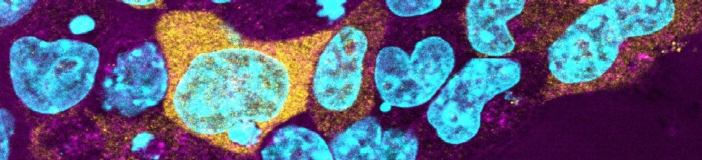

# Home

**Welcome to the Brickman Lab wiki!**

Here you can find documentation for our analysis workflows. For more information about our research, visit the
[Brickman Group website](https://renew.ku.dk/research/brickman_group/).

## Transcriptional basis for cell fate choice

The Brickman Group aims to understand the transcriptional basis for early embryonic lineage specification.

We are interested in the dynamic mechanisms by which cells can both reversible prime towards a particular fate or undergo a transition into commitment.

## Publications

??? note "Selected publications"
    Bone, R. A., Lowndes, M. P., Raineri, S., Riveiro, A. R., Lundregan, S. L., Dall, M., Sulek, K., Romero, J. A. H., Malzard, L., Koigi, S., Heckenbach, I. J., Solis-Mezarino, V., Völker-Albert, M., Vasilopoulou, C. G., Meier, F., Trusina, A., Mann, M., Nielsen, M. L., Treebak, J. T., and Brickman, J. M. **(2025)**. [Altering metabolism programs cell identity via NAD+-dependent deacetylation](https://link.springer.com/article/10.1038/s44318-025-00417-0). _The EMBO Journal_, 44, 3056-3084, doi: 10.1038/s44318-025-00417-0.

    Proks, M., Salehin, N., and Brickman, J. M. **(2025)**. [Deep learning-based models for preimplantation mouse and human embryos based on single-cell RNA sequencing](https://www.nature.com/articles/s41592-024-02511-3). _Nature Methods_, 22, 207-216, doi: 10.1038/s41592-024-02511-3.

    Perera, M., and Brickman, J. M. **(2024)**. [Common modes of ERK induction resolve into context-specific signalling via emergent networks and cell-type-specific transcriptional repression](https://journals.biologists.com/dev/article/151/21/dev202842/362559/Common-modes-of-ERK-induction-resolve-into-context). _Development_, 151 (21), dev202842, doi: 10.1242/dev.202842.

    Linneberg-Agerholm, M., Sell, A. C., Redó-Riveiro, A., Perera, M., Proks, M., Knudsen, T. E., Barral, A., Manzanares, M., and Brickman, J. M. **(2024)**. [The primitive endoderm supports lineage plasticity to enable regulative development](https://www.cell.com/cell/fulltext/S0092-8674(24)00595-6). _Cell_, 187(15), 4010-4029.e16, doi: 10.1016/j.cell.2024.05.051.

    Redó-Riveiro, A., Al-Mousawi, J., Linneberg-Agerholm, M., Proks, M., Perera, M., Salehin, N., and Brickman, J. M. **(2024)**. [Transcription factor co-expression mediates lineage priming for embryonic and extra-embryonic differentiation](https://www.sciencedirect.com/science/article/pii/S2213671123004952?via%3Dihub). _Stem Cell Reports_, 19(2), 174-186, doi: 10.1016/j.stemcr.2023.12.002.

    Knudsen, T. E., Hamilton, W. B., Proks, M., Lykkegaard, M., Linneberg-Agerholm, M., Nielsen, A. V., Perera, M., Malzard, L. L., Trusina, A., Brickman, J. M. **(2023)**. [A bipartite function of ESRRB can integrate signaling over time to balance self-renewal and differentiation](https://www.sciencedirect.com/science/article/pii/S2405471223002156?via%3Dihub). _Cell Systems_, 14(9), 788-805.e8, doi: 10.1016/j.cels.2023.07.008.

    Wong, Y. F., Kumar, Y., Proks, M., Herrera, J. A. R., Rothová,M. M., Monteiro, R. S., Pozzi, S., Jennings, R. E., Hanley, N. A., Bickmore, W. A., and Brickman, J. M. **(2023)**. [Expansion of ventral foregut is linked to changes in the enhancer landscape for organ-specific differentiation](https://www.nature.com/articles/s41556-022-01075-8). _Nature Cell Biology_, 25, 481-492, doi: 10.1038/s41556-022-01075-8.

    Perera, M., Nissen, S. B., Proks, M., Pozzi, S., Monteiro, R. S., Trusina, A., and Brickman, J. M. **(2022)**. [Transcriptional heterogeneity and cell cycle regulation as central determinants of Primitive Endoderm priming](https://elifesciences.org/articles/78967). _eLife_, doi: 10.7554/eLife.78967.

    Rothová, M. M., Nielsen, A. V., Proks, M., Wong, Y. F., Riveiro, A. R., Linneberg-Agerholm, M., David, E., Amit, I., Trusina, A., and Brickman, J. M. **(2022)**. [Identification of the central intermediate in the extra-embryonic to embryonic endoderm transition through single-cell transcriptomics](https://www.nature.com/articles/s41556-022-00923-x). _Nature Cell Biology_, 24, 833-844, doi: 10.1038/s41556-022-00923-x.

    Riveiro, A. R., and Brickman, J. M. **(2020)**. [From pluripotency to totipotency: an experimentalist's guide to cellular potency](https://journals.biologists.com/dev/article/147/16/dev189845/223002/From-pluripotency-to-totipotency-an). _Development_, 147(16), doi: 10.1242/dev.189845.

    Hamilton, W.B., Mosesson, Y., Monteiro, R.S., Emdal, K.B., Knudsen, T.E., Francavilla, C., Barkai, N., Olsen, J.V. and Brickman, J.M. **(2019)**. [Dynamic lineage priming is driven via direct enhancer regulation by ERK](https://www.nature.com/articles/s41586-019-1732-z). _Nature_, 575, 355-360, doi: 10.1038/s41586-019-1732-z.

    Weinert, B.T., Narita, T., Satpathy, S., Srinivasan, B., Hansen, B.K., Scholz, C., Hamilton, W.B., Zucconi, B.E., Wang, W.W., Liu, W.R., Brickman, J.M., Kesicki, E.A., Lai, A., Bromberg, K.D., Cole, P.A., and Choudhary, C. **(2018)**. [Time-Resolved Analysis Reveals Rapid Dynamics and Broad Scope of the CBP/p300 Acetylome](https://www.sciencedirect.com/science/article/pii/S0092867418305269?via%3Dihub). _Cell_ 174, 231-244.e212, doi:10.1016/j.cell.2018.04.033.

    Anderson, K.G.V., Hamilton, W.B., Roske, F.V., Azad, A., Knudsen, T.E., Canham, M.A., Forrester, L.M., and Brickman, J.M. **(2017)**. [Insulin fine-tunes self-renewal pathways governing naive pluripotency and extra-embryonic endoderm](https://www.nature.com/articles/ncb3617). _Nature Cell Biology_ 19, 1164-1177, doi:10.1038/ncb3617.

    Nissen, S.B., Perera, M., Gonzalez, J.M., Morgani, S.M., Jensen, M.H., Sneppen, K., Brickman, J.M., and Trusina, A. **(2017)**. [Four simple rules that are sufficient to generate the mammalian blastocyst](https://journals.plos.org/plosbiology/article?id=10.1371/journal.pbio.2000737). _PLoS Biol_ 15, e2000737, doi:10.1371/journal.pbio.2000737.  *joint senior author

    Migueles, R.P., Shaw, L., Rodrigues, N.P., May, G., Henseleit, K., Anderson, K.G., Goker, H., Jones, C.M., de Bruijn, M.F., Brickman, J.M., and Enver, T. **(2017)**. [Transcriptional regulation of Hhex in hematopoiesis and hematopoietic stem cell ontogeny](https://www.sciencedirect.com/science/article/pii/S0012160616306388?via%3Dihub). _Developmental Biology_ 424, 236-245, doi:10.1016/j.ydbio.2016.12.021.

    Illingworth, R.S., Hölzenspies, J.J., Roske, F.V., Bickmore, W.A., and Brickman, J.M. **(2016)**. [Polycomb enables primitive endoderm lineage priming in embryonic stem cells](https://elifesciences.org/articles/14926). _Elife_ 5, doi:10.7554/eLife.14926.

    Martin Gonzalez, J., Morgani, S.M., Bone, R.A., Bonderup, K., Abelchian, S., Brakebusch, C., and Brickman, J.M. **(2016)**. [Embryonic Stem Cell Culture Conditions Support Distinct States Associated with Different Developmental Stages and Potency](https://www.sciencedirect.com/science/article/pii/S2213671116301333?via%3Dihub). _Stem Cell Reports_ 7, 177-191, doi:10.1016/j.stemcr.2016.07.009.

## Datasets

[Proks et al., (2025). Nature Methods](https://zenodo.org/records/13749348) Application of deep learning tools to curated list of published scRNA-seq datasets from early embryos to generate dynamic models with predictive power that can be used to benchmark in vitro cell types. Dataset and trained models with parameters.

[Redó-Riveiro et al., (2024) Stem Cell Reports](https://zenodo.org/records/10261849) 10x RNA-seq in embryonic stem cells (ESC). We identify a population resembling unsegreggated ICM that co-expresses the extra-embryonic factor GATA6 alongside the embryonic factor SOX2.

[Linneberg-Agerholm et al., (2024). Cell.](https://zenodo.org/records/11210810) scRNA-seq on nEnd differentiated in TSC medium.

[Knudsen et al., (2023). Cell Systems](https://zenodo.org/records/14719594) MARS-seq2 of specific populations in NanogΔ:Esrrb cells and the parent NanogΔ cells, sorted based on PECAM+ and PDGFRα.

[Rothova et al., (2022). Nature Cell Biology.](https://zenodo.org/record/6566016#.ZFoIu9JBxhF) Single-cell RNA-seq datasets from FOXA2Venus reporter mouse embryos and embryonic stem cell differentiation towards endoderm.
